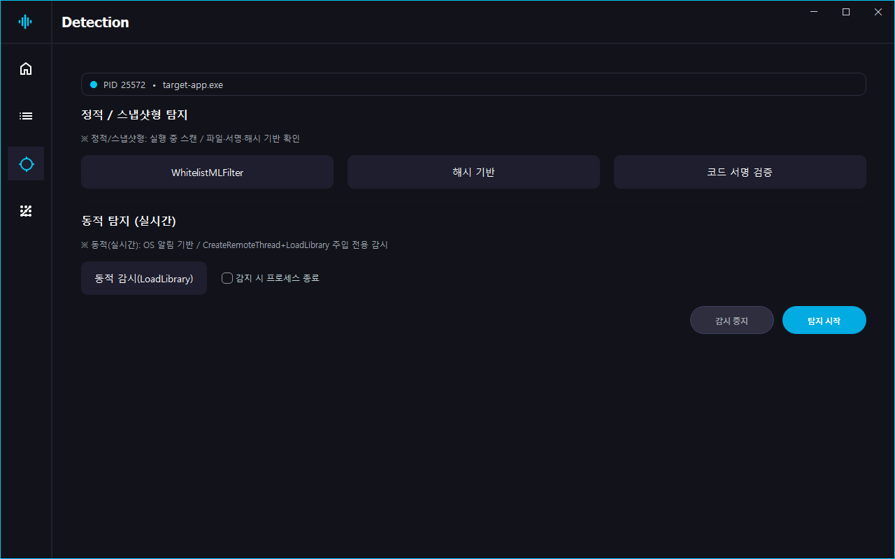

# DLLDetect

**Detect, Analyze, and Visualize Injection.**  
Windows 환경에서 DLL 인젝션의 원리와 탐지 기법을 학습하기 위해 개발된 연구용 프로젝트입니다.  
인젝션 행위를 실험적으로 탐지·분석하고, 과정을 직관적으로 시각화할 수 있도록 구현되었습니다.

## 목차
- [프로젝트 개요](#프로젝트-개요)
- [주요 기능](#주요-기능)
- [GUI 미리보기](#GUI-미리보기)
- [시스템 아키텍처](#시스템-아키텍처)
- [모듈 설명](#모듈-설명)
- [개발 환경](#개발-환경)
- [디렉터리 구조](#디렉터리-구조)
- [로그 및 결과물](#로그-및-결과물)
- [향후 계획](#향후-계획)
- [면책 조항](#면책-조항)


## 프로젝트 개요
DLLDetect는 DLL 인젝션의 동작 원리와 탐지 과정을 학습하기 위한 프로젝트로,  
Windows 환경에서 다양한 탐지 기법을 실험적으로 구현했습니다.  
<br />
본 시스템은 다음과 같은 두 가지 방식을 중심으로 작동합니다:
1. 정적 탐지(Static Detection) — 해시 검증, 코드 서명, 화이트리스트·ML 필터링을 통한 무결성 확인
2. 동적 탐지(Dynamic Detection) — 디버그 이벤트 기반 인젝션 행위 감시<br />  

탐지 결과는 Qt 기반 GUI를 통해 시각적으로 확인할 수 있으며,  
정적 탐지 결과는 CSV 로그로 자동 저장됩니다.

## 주요 기능
| 구분 | 기능 | 설명 |
|------|------|------|
| 정적 탐지 | **화이트리스트 + ML 필터링** | 화이트리스트 등록 여부를 우선 확인하고, 미등록 DLL은 원격 ML 서버에 전송하여 정상/비정상 판정 |
| 정적 탐지 | **해시 기반 무결성 검증** | SHA-256 해시 비교로 DLL 변조 및 비인가 로드 여부 확인  |
| 정적 탐지 | **코드 서명 검증** | `WinVerifyTrust` API를 통해 서명 유효성 확인 |
| 동적 탐지 | **디버그 이벤트 모니터링** | `CreateRemoteThread` / `LoadLibrary` 이벤트 감시를 통한 인젝션 행위 탐지 |
| 로깅 | **CSV 로그 관리** | 정적 탐지 결과를 CSV 파일로 저장 |
| 시각화 | **로그 뷰어** | 저장된 로그 파일을 테이블 형태로 조회 가능 |
| GUI | **Qt 기반 인터페이스** | 프로세스 선택, 탐지 실행, 결과 시각화 및 로그 확인 |

## GUI 미리보기




- **홈 스테이지(Home):** 프로젝트 소개 및 탐지 시작 진입점  
- **프로세스 선택 스테이지(Process Selection):** 현재 실행 중인 프로세스 목록을 표시하고, 대상 선택  
- **탐지 스테이지(Detection):** 정적·동적 탐지 수행, 결과 표시 및 로그 저장

## 시스템 아키텍처
```
[ 사용자 (GUI) ]  <-->  [ GUI 모듈 (Qt) ]
                           ↑
                           |
                    [ 로그 관리 모듈 ]
                           ↑
                           |
                 [ 탐지 모듈 (Static / Dynamic) ]
```


- **GUI 모듈**은 탐지 모듈과 동일 프로세스 내에서 **함수 호출 방식**으로 연동됩니다. 추후 외부 서비스 또는 별도 프로세스로 분리 시, **IPC(프로세스 간 통신)** 구조로 확장할 수 있습니다.
- **정적 탐지 결과**는 로그 관리 모듈을 통해 CSV로 저장되며, **동적 탐지 결과**는 실시간으로만 GUI에 표시됩니다.

## 모듈 설명
### GUI 모듈 (`gui/`)
- **MainWindow**
  - 프로세스 목록 로드 및 선택, 탐지 방식 실행 제어.
  - 선택된 프로세스의 DLL 목록 표시.

> **정책:** GUI에서는 한 번에 하나의 탐지만 실행되도록 제한.  
> 출력 영역이 하나이므로 탐지 중 중복 실행을 방지합니다.

### 화이트리스트 + ML 필터 (`WhitelistMLFilter`)
- **WhitelistManager**
  - 화이트리스트 파일(`whitelist.txt`)을 로드해 DLL 파일명(대소문자 무시)으로 비교.
- **NetworkDLLAnalyzer**
  - 미등록 DLL을 원격 서버로 전송하여 분석 요청.  
  - 단건 요청: `/predict` / 배치 요청: `/bulk_predict`  
  - DLL을 Base64로 인코딩 후 JSON POST로 전송.  
  - 분석 결과(예측값, 출처)는 `analysisFinished()` 시그널로 GUI에 전달.

### 정적 탐지 모듈 (`Static Detection`)
  - **HashComparator**
    - SHA-256 해시 계산 후 기준 해시 목록과 비교하여 변조 여부 판단.
  - **CodeSignatureAnalyzer**
    - `WinVerifyTrust` 기반 코드 서명 검증 수행.  
    - 서명이 없거나 신뢰되지 않은 경우 의심으로 분류.
  
  > **정적 탐지는 DLL의 파일 무결성과 신뢰성을 확인하며, 모든 결과는 CSV 로그로 저장됩니다.**


### 동적 탐지 모듈 (`Dynamic Detection`)
- **DebugEventMonitor**
  - `DebugActiveProcess`로 지정 PID의 이벤트를 수신.  
  - `CREATE_THREAD`, `LOAD_DLL` 이벤트를 감시하여 연관 여부(스레드 생성 후 DLL 로드)를 분석.  
  - 경로 위험도(Temp, Downloads 등) 및 이벤트 링크 여부로 점수를 계산.  
  - 일정 점수 이상이면 경고(`alert` 시그널) 발생.  
  - `autoKill` 모드 시 `TerminateProcess()` 호출로 프로세스 종료.

> **동적 탐지는 실시간 표시 중심이며, 파일 로그는 생성하지 않습니다.**

### 로그 관리 모듈
- **LogManager**
  - 정적 탐지 결과를 CSV 형식으로 저장.  
  - 파일명 예시: `1234-GameClient-Static.csv`  
  - 컬럼: `timestamp, PID, dll_path, result`
- **LogViewerWidget**
  - 저장된 로그 파일을 읽어 테이블로 표시.

> **로그 정책:** 정적 탐지 결과만 CSV 저장, 동적 탐지는 실시간 GUI 표시 전용.

## 개발 환경

| 항목 | 내용 |
|------|------|
| 언어 | C++17 |
| 프레임워크 | Qt 6.9.x |
| 빌드 시스템 | CMake + Ninja |
| 툴체인 | MinGW-w64 64bit |
| 운영체제 | Windows 10 / 11 |
| 외부 연동 | Flask ML 서버 (AWS EC2 환경) |

## 디렉터리 구조
```
DLLDetect/
├── gui/                              # Qt GUI (메인 윈도우)
│   ├── mainwindow.cpp
│   ├── mainwindow.h
│   └── mainwindow.ui
├── include/                          # 공용 헤더(프로젝트 전역)
├── resources/                        # 아이콘/이미지/QSS 등 리소스(qrc 연동)
├── src/                              # 핵심 로직
│   ├── CodeSignatureAnalyzer.cpp     # 코드 서명 검증 (WinVerifyTrust)
│   ├── DebugEventMonitor.cpp         # 동적 탐지 (디버그 이벤트 기반)
│   ├── DLLAnalyzer.cpp               # 프로세스 선택 스테이지: DLL 정보 출력
│   ├── HashComparator.cpp            # SHA-256 해시 계산 및 비교
│   ├── logmanager.cpp                # 정적 탐지 결과 CSV 로그 저장
│   ├── LogViewerWidget.cpp           # CSV 로그 뷰어(테이블 렌더)
│   ├── NetworkDLLAnalyzer.cpp        # Whitelist 미등록 DLL → Flask(EC2) 분석 요청
│   ├── ProcessManager.cpp            # 프로세스 스캔/결과 집계
│   ├── Result.cpp                    # 탐지/스캔 결과 구조체 구현
│   └── WhitelistManager.cpp          # 화이트리스트 로드/판정
├── tools/                            # (EC2 이전) Flask 서버 & ML 모델/파이썬 스크립트
├── .gitignore
├── appicon.rc                        # Windows 리소스(아이콘)
├── CMakeLists.txt
├── main.cpp                          # 엔트리 포인트
└── README.md
```

## 로그 및 결과물
탐지 결과는 CSV 로그 파일과 GUI 로그 뷰어를 통해 확인할 수 있습니다.

- **정적 탐지 결과**
  - 로그 파일은 데스크톱 경로에 자동 저장됩니다.
  - 파일명 예시: `1234-GameClient-Static.csv`
  - 컬럼 구성: `timestamp, PID, dll_path, result`
  - CSV 파일은 GUI의 **로그 스테이지** 에서도 바로 확인할 수 있습니다.

- **동적 탐지 결과**
  - 실시간으로 GUI 탐지 스테이지에 표시되며, 별도의 파일로 저장되지 않습니다.
  - 탐지 이벤트 발생 시 경고 알림 및 로그 메시지가 출력됩니다.

> **참고:** 로그 파일은 탐지 실행 시 자동으로 새로 생성되며,
> 동일한 프로세스에 대해 재탐지할 경우 이전 로그는 덮어쓰지 않고 별도로 저장됩니다.

### 로그 스테이지 화면
> 정적 탐지 후 CSV 로그를 GUI를 통해 조회하는 화면입니다.

![로그 스테이지 화면](./resources/screenshots/log_stage.jpg

## 향후 계획

- **KMDF 커널 드라이버 기반 탐지 확장**
- **머신러닝 모델 고도화 및 데이터셋 확충**
- **클라우드 로그 동기화 및 중앙 관리 기능**

## 면책 조항

본 프로젝트는 **보안 기법 학습 및 연구를 목적으로 한 비상업적 프로젝트**입니다.  
구현된 기능은 학습용 실험 코드로, 실제 상용 환경에서의 사용을 의도하지 않습니다.  
악의적 사용 및 무단 상업적 이용을 금지합니다.
